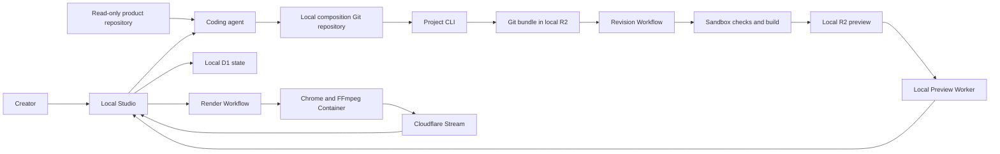

# Programmable Video

Create and review product videos locally, then publish the approved result to Cloudflare Stream.

[](https://github.com/AbdulsaboorS/programmable-video/actions/workflows/verify.yml)

Programmable Video turns a product repository, visual references, and a short brief into a deterministic React video. A coding agent authors the composition in a local Git repository. Studio builds and reviews the exact commit, renders it with Chrome and FFmpeg, and publishes the finished video through Stream.

This is an experimental reference implementation, not an official Cloudflare product or a hosted service.

## The Workflow

1. **Draft:** Create a project, record the product source repository, upload references, and hand a local composition repository to a coding agent.
2. **Review:** Submit a clean commit, inspect its frame-addressable preview, request specific changes, and approve the exact revision.
3. **Finish:** Set trim, output shape, fit, optional audio, and captions without changing the approved source.
4. **Published:** Render and upload to Stream, then use its player, share link, captions, publication history, and downloadable MP4.

The product repository stays read-only. Generated composition code lives in a separate local Git repository. Preview and final rendering use the same implementation at the approved commit.

## Run It Locally

### Requirements

- Node.js 24 and Corepack
- pnpm 11.9.0
- Git
- Docker Desktop
- A Cloudflare account with Stream enabled when you are ready to publish
- A Cloudflare API token with Stream Read and Stream Edit permissions when publishing
- FFmpeg and ffprobe when using the lower-level `pnpm video render` command

Install the workspace:

```sh
corepack enable
pnpm install --frozen-lockfile
```

Create local environment files:

```sh
cp apps/studio/.dev.vars.example apps/studio/.dev.vars
cp apps/preview/.dev.vars.example apps/preview/.dev.vars
```

Set `LOCAL_OWNER_EMAIL` in the Studio file. Generate a signing key with `openssl rand -hex 32` and use it as `PREVIEW_SIGNING_KEY` in both files. Add `STREAM_ACCOUNT_ID` and `STREAM_API_TOKEN` to the Studio file only when you want to publish; drafting, revision submission, preview, and approval do not require Stream.

Start Studio and Preview:

```sh
pnpm dev
```

Studio runs at `http://localhost:5173`. The command applies pending local D1 migrations before starting Studio and Preview. D1, R2, Workflows, Sandbox, Containers, and Preview run locally. Finished videos are uploaded to your Cloudflare Stream account.

If an enterprise TLS proxy intercepts the Renderer's upload to Stream, pass its PEM root certificate when starting Studio. Configure Docker Desktop separately if the proxy also affects image pulls or builds.

```sh
CONTAINER_EXTRA_CA_CERT="$(cat /path/to/root-ca.pem)" pnpm dev
```

Never commit `.dev.vars` or a CA certificate.

### Create A Video Project

Create a project in Studio, add a brief and any PNG references, then choose **Give brief to agent**. Copy the generated instructions into your coding agent while the agent is running from this repository. The instructions initialize a separate composition repository outside every existing Git worktree, run its checks, commit the result, and submit the exact commit to Studio. Reuse that same repository for later change requests.

The CLI creates a bounded Git bundle, records its SHA-256 digest, and submits the exact `main` commit. Studio stores the immutable bundle in local R2 as the only revision source. Sandbox checks out that bundle, verifies the commit, builds the preview, and starts the review flow.

Approve the draft in Studio and choose finishing settings. Publishing requires Stream credentials; a successful publication becomes playable and downloadable from Stream. Without Stream, the workflow ends at an approved local preview rather than a final MP4.

## Architecture



| Component     | Responsibility                                                            |
| ------------- | ------------------------------------------------------------------------- |
| Studio Worker | Creator API, local identity, orchestration, and static application        |
| Project CLI   | Local repository setup and exact-commit bundle submission                 |
| Workflows     | Durable revision checks and managed render execution                      |
| Sandbox SDK   | Isolated checkout, validation, testing, and build                         |
| Containers    | Chrome frame capture and FFmpeg rendering                                 |
| D1            | Projects, revisions, approvals, jobs, and publication state               |
| R2            | Sole revision source, built previews, references, and finishing media     |
| Stream        | Published-video ingestion, encoding, playback, captions, and MP4 delivery |

## Repository Map

| Path                             | Responsibility                                                                |
| -------------------------------- | ----------------------------------------------------------------------------- |
| `apps/project-cli/`              | Local composition repository initialization and submission                    |
| `apps/studio/`                   | React Studio, Worker API, Workflows, migrations, and Cloudflare configuration |
| `apps/preview/`                  | Isolated Worker for exact-revision previews                                   |
| `apps/renderer/`                 | Playwright capture, FFmpeg finishing, validation, and Stream upload           |
| `packages/contracts/`            | Runtime schemas for HTTP, browser, Workflow, and renderer boundaries          |
| `packages/composition-registry/` | Trusted composition registration and lookup                                   |
| `compositions/`                  | Maintained deterministic React compositions                                   |
| `starters/product-project/`      | Starter copied into each local video project                                  |
| `docs/`                          | Product model, creator journey, finishing contract, and deployment notes      |

## Render A Maintained Composition

The lower-level renderer can inspect and render registered compositions without the Studio flow:

```sh
pnpm --filter @programmable-video/studio build
pnpm video list
pnpm video still support-agent --frame 220
pnpm video render support-agent --output ./out/support-agent.mp4
```

Use `--props ./props.json` to provide validated composition properties.

## Security Boundaries

- Local Studio identity comes from `LOCAL_OWNER_EMAIL`; it is not production authentication.
- Connected product repositories are source context only. Studio never writes to them.
- The project CLI accepts only a clean local `main` commit and submits a size-bounded, digest-verified Git bundle.
- Reference and finishing-media downloads use expiring, digest-bound HMAC capabilities.
- Sandbox builds retain outbound network access. Add an egress policy before accepting untrusted public users.
- Preview and Stream URLs are bearer capabilities in this prototype.
- `.dev.vars` contains credentials and must stay untracked.

See [SECURITY.md](SECURITY.md) before operating this outside a trusted local environment. The [deployment runbook](docs/deployment-runbook.md) documents the supported local Git bundle workflow.

## Quality

Run the complete gate:

```sh
pnpm format:check
pnpm lint
pnpm typecheck
pnpm types:check
pnpm test
pnpm build
pnpm --dir starters/product-project verify
```

GitHub Actions runs the same checks on pull requests and pushes to `main`.

## Scope

The current path supports one read-only public GitHub repository per project, uploaded PNG references, external-agent Git handoff, exact-commit checks, immutable approval, constrained finishing, and Stream delivery for 12- or 15-second 1280x720 videos at 30 fps.

General timeline editing, arbitrary formats and durations, public tenancy, a managed in-Studio agent, private-repository authentication, quotas, and retention automation remain outside the current scope.

## Contributing

Read [CONTRIBUTING.md](CONTRIBUTING.md) and [AGENTS.md](AGENTS.md). Composition changes must keep every rendered frame a deterministic function of the frame number and typed properties.

## License

Licensed under the [Apache License 2.0](LICENSE).
