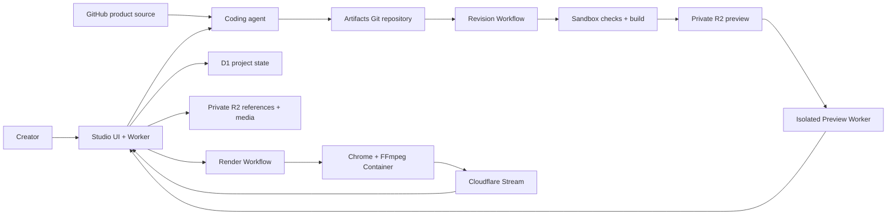

# Programmable Video

An agent-native product video studio built on Cloudflare.

[](https://github.com/AbdulsaboorS/programmable-video/actions/workflows/verify.yml)

Programmable Video turns a product repository, visual references, and a short brief into a deterministic React video. A coding agent authors the composition, the Studio builds and reviews its exact Git commit, and Cloudflare renders and publishes the approved result through Stream.

This repository is an experimental reference implementation for developers exploring what they can build with Cloudflare's developer platform. It is not an official Cloudflare product or a one-click production service.

## Fastest Way To Try It

Run the standalone product-video starter. This takes about five minutes on a machine with Node.js installed and does not require a Cloudflare account:

```sh
cd starters/product-project
corepack enable
pnpm install --frozen-lockfile
pnpm dev
```

The starter provides browser preview and exact-frame rendering. Run `pnpm verify` to check formatting, types, tests, and the production build. MP4 rendering and publishing require the complete Studio pipeline.

## Choose How To Run It

| Goal                                   | What you need                                                                 |
| -------------------------------------- | ----------------------------------------------------------------------------- |
| Explore the Studio UI locally          | Node.js and pnpm. No Cloudflare account or Access login.                      |
| Preview or render compositions locally | Chromium; FFmpeg and ffprobe for image or video output.                       |
| Deploy the complete managed Studio     | Workers Paid, Stream, Artifacts private-beta access, and the resources below. |

`pnpm dev` starts the interface without an email sign-in. Cloudflare Access protects only a deployed Studio because the application does not yet provide its own user accounts, quotas, or abuse controls.

## The Workflow

1. **Draft:** Record a GitHub source repository, upload visual references, describe the story, and copy a temporary handoff to a coding agent.
2. **Review:** Build the agent's exact commit, inspect a frame-addressable preview, request frame-specific changes, and confirm product fidelity.
3. **Finish:** Approve one immutable revision, then set trim, output shape, fit, optional audio, and captions.
4. **Publish:** Render with managed Chrome and FFmpeg, upload to Stream, and provide playback, MP4 download, sharing, retries, and history.

The source repository stays read-only. Generated composition code lives in a managed Cloudflare Artifacts Git repository. Preview and final rendering use the same deterministic React implementation at the approved commit.

## Cloudflare Architecture



| Product     | Responsibility                                                          |
| ----------- | ----------------------------------------------------------------------- |
| Workers     | Studio API, static application, isolated preview, and orchestration     |
| Workflows   | Durable revision checks and managed render execution                    |
| Containers  | Chrome frame capture and FFmpeg rendering                               |
| Sandbox SDK | Isolated install, validation, testing, and build of agent-authored code |
| Artifacts   | Managed Git repositories and exact-commit source retrieval              |
| D1          | Projects, revisions, approvals, jobs, and publication state             |
| R2          | Built previews, uploaded references, and finishing media                |
| Stream      | Video ingestion, encoding, playback, captions, and MP4 delivery         |
| Access      | Identity boundary around the creator Studio                             |

## Repository Map

| Path                             | Responsibility                                                                |
| -------------------------------- | ----------------------------------------------------------------------------- |
| `apps/studio/`                   | React Studio, Worker API, Workflows, migrations, and Cloudflare configuration |
| `apps/preview/`                  | Isolated Worker for exact-revision previews                                   |
| `apps/renderer/`                 | Playwright capture, FFmpeg finishing, validation, and Stream upload           |
| `packages/contracts/`            | Runtime schemas for HTTP, browser, Workflow, and renderer boundaries          |
| `packages/composition-registry/` | Trusted composition registration and lookup                                   |
| `compositions/`                  | Maintained deterministic React compositions                                   |
| `starters/product-project/`      | Seed project forked for each managed product video                            |
| `docs/`                          | Product model, creator journey, finishing contract, and deployment guide      |

## Try It Locally

### Requirements

- Node.js 24 and Corepack
- pnpm 11.9.0
- FFmpeg and ffprobe for local image or video output
- A Playwright-compatible Chromium installation
- Docker only for Container builds and full Cloudflare deployment

Install dependencies:

```sh
corepack enable
pnpm install --frozen-lockfile
pnpm --filter @programmable-video/renderer exec playwright install chromium
```

Start the Studio interface:

```sh
pnpm dev
```

The interface runs locally. The managed project APIs require the Cloudflare resources and credentials described in [the deployment guide](docs/deployment-runbook.md).

### Render A Maintained Composition

Build the Studio bundle, inspect the registry, and render locally:

```sh
pnpm --filter @programmable-video/studio build
pnpm video list
pnpm video still support-agent --frame 220
pnpm video render support-agent --output ./out/support-agent.mp4
```

The renderer captures deterministic browser frames and encodes them with FFmpeg. Use `--props ./props.json` to provide validated composition properties.

## Deploy The Complete Studio

The complete Studio is not a free-tier deployment. Pricing and availability below were checked on September 2, 2026 and may change.

| Requirement          | Plan or cost                                                                                                                                                 |
| -------------------- | ------------------------------------------------------------------------------------------------------------------------------------------------------------ |
| Workers              | Workers Paid is required by Containers and Sandbox. It starts at [$5 USD per month](https://developers.cloudflare.com/workers/platform/pricing/).            |
| Workflows            | Included with Workers Paid, with monthly usage allowances and overage pricing.                                                                               |
| Containers + Sandbox | Included usage comes with Workers Paid; additional CPU, memory, disk, and network usage is metered.                                                          |
| D1                   | Workers Paid includes usage allowances; additional rows and storage are metered.                                                                             |
| R2                   | Includes a monthly free allowance; storage and operations beyond it are metered. R2 egress is free.                                                          |
| Stream               | Paid separately: [$5 per 1,000 stored minutes and $1 per 1,000 delivered minutes](https://developers.cloudflare.com/stream/pricing/).                        |
| Artifacts            | Required and currently in [private beta](https://developers.cloudflare.com/changelog/post/2026-04-16-artifacts-now-in-beta/). Your account must have access. |
| Access               | A Zero Trust free plan can protect a small deployment. Users authenticate only when opening the deployed Studio.                                             |

Deployment is manual and intended for experienced Cloudflare developers. It requires:

- Creating and configuring D1, three R2 buckets, an Artifacts namespace and seed repository.
- Setting Worker secrets and account-specific origins.
- Deploying the Preview Worker before the Studio Worker.
- Protecting Studio with Access while bypassing only two capability-protected internal media paths.
- Accepting the cost and security responsibility of running agent-authored code in Sandbox and Containers.

Follow [the deployment runbook](docs/deployment-runbook.md). Do not deploy using the example defaults without replacing them for your account.

## Security Boundaries

- The Studio is designed to run behind Cloudflare Access.
- Generated repository credentials are temporary, scoped, returned with `Cache-Control: private, no-store`, and never persisted in plaintext by Studio.
- Reference and finishing-media downloads use expiring, digest-bound HMAC capabilities.
- Connected GitHub repositories are source context only. Studio does not verify repository access; the coding agent must be able to read them.
- Sandbox builds currently retain outbound network access. Add an egress policy before accepting untrusted public users.
- Preview and Stream URLs are bearer capabilities in this prototype.

See [SECURITY.md](SECURITY.md) before operating a deployment.

## Quality

Run the complete local gate:

```sh
pnpm format:check
pnpm lint
pnpm typecheck
pnpm test
pnpm build
```

GitHub Actions runs the same checks on pull requests and pushes to `main`.

## Project Scope

The current path supports one GitHub source repository per project, uploaded PNG references, external-agent Git handoff, exact-commit checks, immutable approval, constrained finishing, and Stream delivery for 12- or 15-second 1280x720 videos at 30 fps.

It is not a general timeline editor, hosted public SaaS, or automated one-click deployment. Authentication for private GitHub source repositories, public tenancy, quotas, retention automation, and Sandbox egress restrictions remain future work.

## Contributing

Read [CONTRIBUTING.md](CONTRIBUTING.md) and [AGENTS.md](AGENTS.md). Composition changes must keep every rendered frame a deterministic function of the frame number and typed properties.

## License

Licensed under the [Apache License 2.0](LICENSE).
